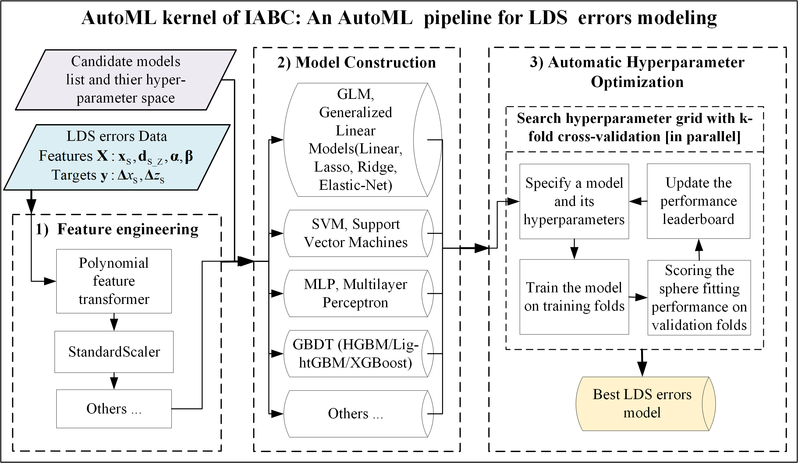

# IABC: An Iteratively Automatic Machine Learning Boosted Hand-eye Calibration Method for the Laser Displacement Sensor 
HeLin Li (lihelin@tju.edu.cn), Bin Lin (linbin@tju.edu.cn), Tianyi Sui, etc.; Tianjin University, Tianjin, China ; License: CC-BY-4.0 license @ 2022-06-07

**IABC is a novel hand-eye calibration method for robotic inspection systems with the 2D laser displacement sensor. IABC makes it possible for the analytical parameters and LDS errors to be online calibrated in one calibration process without any hardware changes. IABC caneffectively improve the measurement accuracy and precision of the systems.**

<div style="text-align: center">

</div>

# Highlights
* Novel IABC method to calibrate hand-eye parameters and laser displacement sensor (LDS) errors in one process
* New Hybrid calibration model composed of the analytical kernel and the AutoML kernel
* New Data-driven AutoML pipeline to automatically model LDS errors
* Four new local features and two local targets were constructed for modeling LDS errors.
# Achievements
* The calibration RMSE was reduced anout 50%
* The measurement deviation was reduced by more than 50%, and RMSE was reduced by 10%~40%

# Methodology
## Architecture of IABC

## AutoML pipeline for automatically modeling of LDS errors

## New local features and targets of LDS errors


# Abstract
To improve the measurement accuracy and precision of an on-machine measuring (OMM) robot with a 2D laser displacement sensor (LDS),  a novel Iteratively Automatic machine learning Boosted hand-eye Calibration (IABC) Method is proposed. It calibrates both the hand-eye relationship and LDS measurement errors in one calibration process without any hardware changes. Firstly, a new objective function is derived, which contains both analytical parameters of the hand-eye relationship and LDS errors. A hybrid calibration model composed of two kernels is proposed to solve the objective function. One kernel is the analytical kernel designed for solving analytical parameters. Another kernel is the automatic machine learning (AutoML) kernel designed to model LDS errors. The two kernels are connected with stepwise iterations to find the best calibration results. In the AutoML kernel, a new data-driven AutoML pipeline embedded with several candidate machine learning models is proposed, then the competition mechanism is introduced to select the best estimator of LDS errors automatically. Compared with traditional methods, hand-eye experiments show that IABC reduced the calibration RMSE by about 50%. Verification experiments show that IABC reduced the measurement deviation by more than 50% and reduced the fitting RMSE by 10%~40%. Even when the training data was obviously less than the test data, IABC performed well, too. Experiments demonstrate that IABC is more accurate and precise than traditional hand-eye methods. This work provides new ideas for the hand-eye calibration field and other related fields in metrology. 

# Installation

```
pip install -r requierments.txt
python -m pip install jupyter_contrib_nbextensions
jupyter contrib nbextension install --user --skip-running-check  
```

# Usage
```
1. Start jupyter notebook
2. Open the ```main_of_IABC.ipynb``` in a browser or the Pycharm
3. Specify your own variables like fname_train, fname_test, and other parameters
5. Run the jupyter cells
```

# Snapshot


# Data Availability
Due to the massive amount of the original dataset, this repo cannot upload them, please contact us if needed

# Acknowledgement
Thanks to following projects: scipy, numpy, pandas, skspatial, scikit-learn, open3d, etc. 

# Contact us
Any problem in usage, please feel free to contact us --> lihelin@tju.edu.cn, Tianjin University, Tianjin, China
